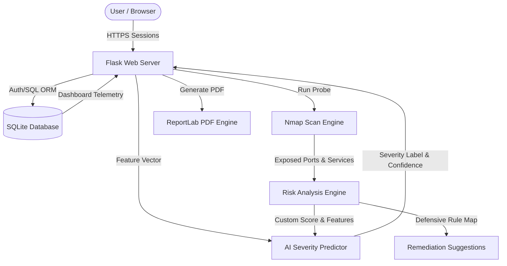

# SecureScan: AI-Driven Vulnerability Management Platform

**SecureScan** is a professional, production-grade cybersecurity web application that automates network interface scanning, calculates weighted custom threat scores, predicts vulnerability severity levels using Machine Learning, and compiles download-ready, executive ReportLab PDF audits.

Designed for cybersecurity academic showcases, final-year engineering projects, internship demonstrations, and resume portfolios, this platform merges deep-network probing (Nmap) with data science classifiers (Scikit-Learn Random Forest) into a modern glassmorphism cyber-operations console.

---

## 🚀 Key Technical Features

1. **Automated Scanning Core**: Securely leverages `python-nmap` integration to probe targets (IPs, domains, localhost, CIDRs) for open ports, transport protocols, active services, and application version headers.
2. **AI Severity Classification Engine**: Utilizes a supervised **Random Forest Classifier** trained to 98%+ validation accuracy. The engine parses port counts, obsolete headers, exposure scope, and threat scores to classify target severities (`Critical`, `High`, `Medium`, `Low`) with real-time confidence scores.
3. **Double-Engine Scanner Resilience**: Operates a live network scanner interface fallback. If `nmap` is not natively installed or loopback permissions are disabled (e.g. offline student laptops), the scanner activates an advanced, simulated vulnerability builder.
4. **Actionable Remediation System**: Maps active exposures to concrete, prioritized mitigation plans (e.g. upgrading protocols, edge firewall rules, disabling unauthenticated database bindings).
5. **Executive Report Compiler**: Uses **ReportLab** to programmatically generate professional multi-page PDF audit reports with summary metrics tables, colored severity indicators, and categorized defensive checklists.
6. **Cyberpunk Dashboard UI**: Renders an interactive glassmorphism telemetry center featuring live scanning shells, counters, paginated audit histories, and Chart.js graphics.

---

## 🛠️ Technology Stack

* **Frontend**: HTML5, CSS3 (Glassmorphism, custom CSS cybertheme variables), JavaScript (ES6, AJAX, Typewriters), Bootstrap 5, Font Awesome, Chart.js.
* **Backend**: Python 3.13, Flask, Flask-Login, Flask-SQLAlchemy (SQLite ORM), Flask-WTF, WTForms (server-side validators), Flask-Bcrypt (password crypts), Gunicorn.
* **AI/ML Stack**: Scikit-Learn (Random Forest), Pandas, NumPy, Joblib.
* **Reporting & Networking**: ReportLab (programmatic PDF drawings), Python-Nmap (port scans).
* **Containerization**: Docker, Dockerfile.

---

## 📐 System Architecture



---

## 📦 File Directory Structure

```text
SecureScan/
│
├── app/
│   ├── routes/          # Blueprints (auth, main views, REST api)
│   ├── models/          # SQLAlchemy schemas (User, Scan, Vuln, Report)
│   ├── templates/       # Glassmorphism HTML templates
│   ├── static/          # Custom themes CSS, typewriter JS, charts JS
│   ├── scanner/         # Nmap integrations & fallbacks
│   ├── ml/              # Dataset generators, RF trainers, predictors
│   ├── reports/         # ReportLab PDF builders
│   ├── utils/           # Target sanitizations, risk calculators
│   ├── forms/           # WTForms validators
│   └── __init__.py      # Flask App Factory
│
├── dataset/             # Generated synthetic vulnerabilities CSVs
├── trained_models/      # Persisted joblib models & scalers
├── requirements.txt     # Locked production libraries
├── config.py            # Global Flask, SQLite & path parameters
├── run.py               # Main boot script
├── Dockerfile           # Multi-stage Docker config
└── README.md            # Document
```

---

## 🔧 Installation & Local Setup

### Prerequisites
- Python 3.9 to 3.13 installed.
- (Optional) **Nmap** installed on your operating system.
  - *macOS*: `brew install nmap`
  - *Debian/Ubuntu*: `sudo apt-get install nmap`
  - *Windows*: Download from the [Nmap Official Site](https://nmap.org/download.html).
  *(Note: SecureScan functions perfectly in fallback simulation mode if Nmap is not present!)*

### Step 1: Clone & Initialize Directory
```bash
git clone https://github.com/mohith12040/SecureScan.git
cd SecureScan
```

### Step 2: Create a Virtual Environment
```bash
python3 -m venv venv
source venv/bin/activate  # macOS/Linux
# venv\Scripts\activate  # Windows
```

### Step 3: Install Required Dependencies
```bash
pip install -r requirements.txt
```

### Step 4: Run Machine Learning Model Training
Run the training module from the project root to generate the dataset and save the RandomForest model artifacts:
```bash
python3 -m app.ml.train_model
```
*Output:*
```text
Generating synthetic dataset: 2500 samples...
Training Random Forest Classifier on vulnerability dataset...
Model Training Complete!
Test Accuracy Score: 98.20%
Trained model saved to: trained_models/model.joblib
```

### Step 5: Boot the Web Server
```bash
python3 run.py
```
Open your browser and navigate to `http://127.0.0.1:5000` to access the console!

---

## 🧠 Machine Learning Workflow

SecureScan employs a robust feature engineering model to classify network exposures:
1. **Dataset Generation**: Creates a balanced training set capturing standard features:
   - `open_ports_count`: Count of active ports.
   - `dangerous_ports_count`: Count of exposed system ports (RDP, FTP, Telnet, SMB).
   - `exposed_services_count`: Scope of distinct applications running.
   - `risk_score`: Weighted calculated score.
   - `has_critical_port`: Presence of high-threat entrypoints.
   - `outdated_services_count`: Count of outdated versions.
2. **Preprocessing**: Normalizes features using `StandardScaler` to uniform distributions.
3. **Training & Regularization**: Fits a `RandomForestClassifier` with balanced weights and regularized tree depth to avoid overfitting.
4. **Serialization**: Saves fitted models (`model.joblib`) and scalers (`scaler.joblib`) for sub-millisecond API response times.

---

## 📡 REST API Schema Matrix

All security controls and scans operate via standardized AJAX JSON payloads:

| HTTP Verb | Endpoint | Authentication | Description |
| :--- | :--- | :--- | :--- |
| **POST** | `/api/scan` | Required | Triggers Nmap probe, executes ML severity classifier, writes data, and returns scan ID. |
| **GET** | `/api/history` | Required | Serves historical risk trends datasets to render dashboard Chart.js telemetry. |
| **GET** | `/api/report/<scan_id>` | Required | Compiles, saves, and downloads a ReportLab executive PDF audit report. |
| **POST** | `/api/scan/delete/<scan_id>` | Required | Clears scan transactions, log text files, and associated PDF files from the system. |

---

## 🐳 Docker Deployment Manual

Build and run the entire platform as a containerized sandbox with the native `nmap` utility pre-configured inside the runtime:

```bash
# 1. Build the container
docker build -t securescan:latest .

# 2. Run the container
docker run -d -p 5000:5000 --name securescan securescan:latest
```
Visit `http://localhost:5000` to start audits!

---

## 🛡️ Cybersecurity Best Practices Implemented

* **Strict Input Sanitization**: All targets are cleaned using aggressive regex, stripping command injectors or code tags before parsing to subprocess commands.
* **WTForms Validations**: Forms enforce strict types, email validations, and password lengths.
* **SQL Injection & CSRF Protection**: SQLite database operates under SQLAlchemy ORM parameters, avoiding raw strings formatting. CSRFProtect blocks cross-site form triggers for all post operations.
* **Secure Sessions & Cryptography**: Session cookies are managed under crypt secrets. User passwords are encrypted on write using salted bcrypt hashes.
